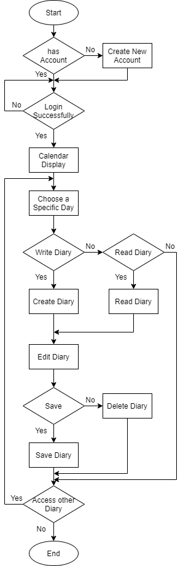

# MyDiary Java Project

## Some Background...
This project was built in 2021 when I was learning java (my first programming language). Many things can be improved looking back from now (2023), but I didn't change any code when uploading this here (merely some restructuring of files and folders) because I want to make a record of what I have accomplished in the past.

It's a very interesting experience looking at the code I wrote two years ago, especially since I have now learned more languages and tools like HTML, CSS, JavaScript, and React framework, and then found out I have already done similar things (laying and interacting with components, adjusting style, etc) when building GUI using java when I first started.

As that being said, this project might not be that helpful if you want to build something that can compete in the App store, but if you want to look at some examples about how to build GUI using Java, this could be a start for you. Happy learning!

## Overview and Design Choices
This is a Java program with GUI that allows for (very naive) login, write, and read diary, build for a client who is a high school teacher. Since the user's need is to save time, when designing this app I added a special function so the user can insert stickers to replace writing.

I chose to use Swing in this project to write GUI because it's an easy way to start writing simple UI components since it has a large library of elements.

Here is a flowchart I drew when I was planning out my program:

## How to Run
Go into the src/java folder and run `javac *.java` in the terminal, then run `java Main`.